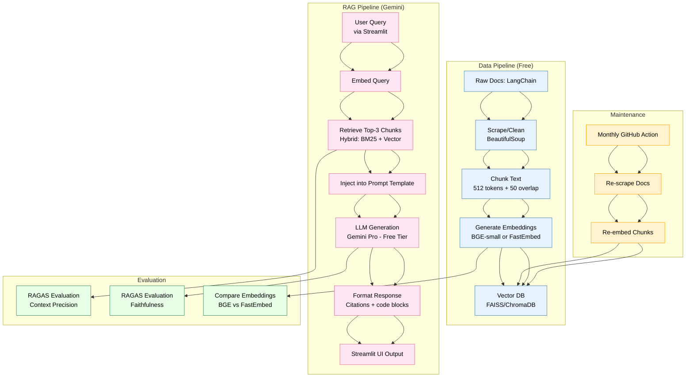

# 🧠 RAG-Pilot: Documentation Intelligence System

[](https://opensource.org/licenses/MIT)
[](https://www.python.org/downloads/)


A production-grade Retrieval-Augmented Generation (RAG) system for querying technical documentation with precise, context-grounded responses using Gemini and FAISS.
## 📂 Project Structure
``` bash
rag-pilot/
├── app/ # Application code
│ ├── app.py # CLI interface
│ ├── rag_chain.py # Core RAG pipeline
│ └── init.py # Package initialization
│
├── config/ # Configuration files
│ ├── settings.py # Main settings
│ └── logging.conf # Logging configuration
│
├── data/ # Documentation data
│ └── langchain/
│ ├── processed/ # Processed chunks
│ └── raw/ # Original documents
│
├── scripts/ # Data processing scripts
│ ├── scrape_docs.py # Documentation scraper
│ ├── chunk.py # Text chunking
│ └── embed.py # Embedding generation
│
├── tests/ # Test suite
│ ├── test_rag.py # RAG pipeline tests
│ ├── test_retrieval.py # Retrieval tests
│ └── test_llm.py # LLM interaction tests
│
├── evaluation/ # Evaluation scripts
│ └── ragas_eval.py # RAGAS metrics
│
├── requirements.txt # Main dependencies
├── LICENSE # MIT License
└── README.md # This file
```
## 🌟 Features

- **Accurate Technical Answers**: Grounded in official documentation
- **Optimized Retrieval**: FAISS + MMR search with FastEmbed embeddings
- **Full Pipeline Visibility**: Debug mode shows retrieval scores and chunks
- **Production Ready**: Config validation and system health checks
- **Cost Efficient**: Local embeddings with optional cloud LLM

## 🛠 Tech Stack

| Component           | Implementation       | Alternatives       |
|---------------------|----------------------|--------------------|
| **Embeddings**      | FastEmbed (BGE-small)| OpenAI, Cohere     |
| **Vector Store**    | FAISS                | Chroma, Pinecone   |
| **LLM**            | Google Gemini Pro    | GPT-4, Claude      |
| **Framework**      | LangChain            | LlamaIndex         |
| **Evaluation**     | RAGAS                | Custom metrics     |

## 📅 Project Phases

| Phase | Name                          | Status    | Key Deliverables                          |
|-------|-------------------------------|-----------|-------------------------------------------|
| 1     | Planning & Scope Finalization | ✅ Done   | Tech stack, Architecture diagram         |
| 2     | Data Ingestion & Embedding    | ✅ Done   | Processed chunks, FAISS index            |
| 3     | RAG Pipeline Implementation   | ✅ Done   | Working retrieval, Gemini integration    |
| 4     | Streamlit UI Development      | 🟡 Active | Chat interface, Response formatting      |
| 5     | Evaluation & Optimization     | ⏳ Pending| RAGAS metrics, Performance tuning        |
| 6     | Deployment & Documentation    | ⏳ Pending| Live demo, Final README                  |
| 7     | Future Enhancements           | ⏳ Later  | Auth system, CLI version                 |

## 📦 Installation

```bash
# Clone repository
git clone https://github.com/Arman001/rag-pilot.git
cd rag-pilot

# Create virtual environment
python -m venv .venv
source .venv/bin/activate  # Linux/Mac
# .venv\Scripts\activate  # Windows

# Install dependencies
pip install -r requirements.txt
```

## 🚀 Usage
### CLI Interface
```bash
python -m app.app

> Ask a question (or 'exit'): Explain LangChain Expression Language
> Answer: LangChain Expression Language (LCEL) provides...
```

### Python API
```bash
from app.rag_chain import rag_pipeline

response = rag_pipeline.query("How to create custom agents?")
print(response)
```

## 🏗️ Architecture


## 🤝 Contributing
1. Fork the repository
2. Create your feature branch:

``` bash
git checkout -b feature/your-feature
```
2. Commit changes:

```bash
git commit -m 'Add some feature'
```
3. Push to branch:

``` bash
git push origin feature/your-feature
```

## 📜 License

Distributed under the MIT License.

## ✉️ Contact
**Website**: [muhammadsaad.dev](https://www.muhammadsaad.dev/)
**Email**: hell@muhammadsaad.dev
